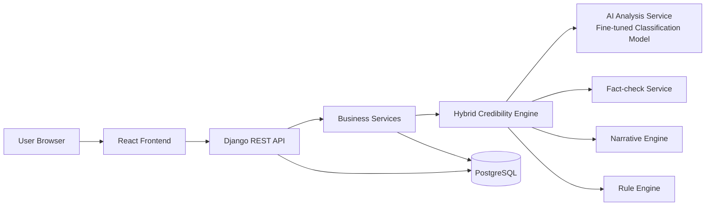
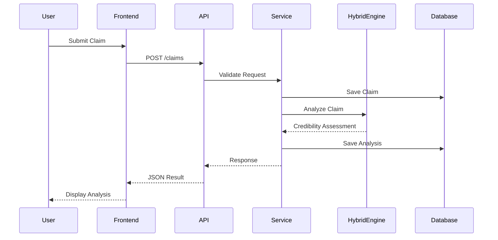
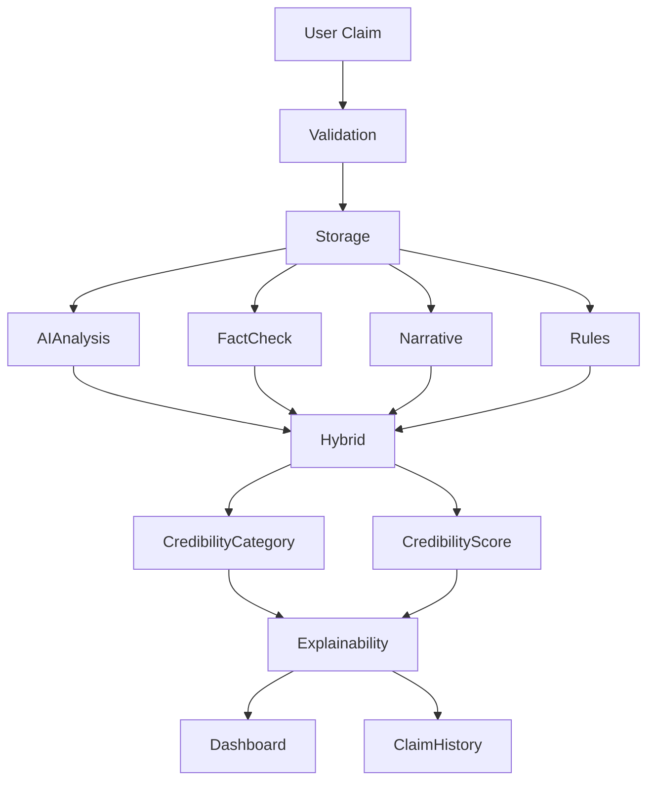
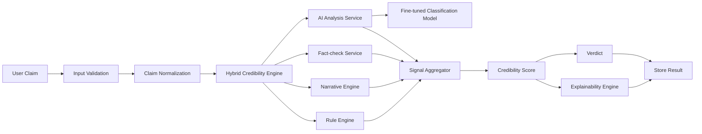
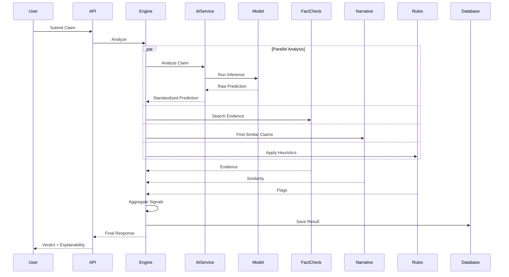
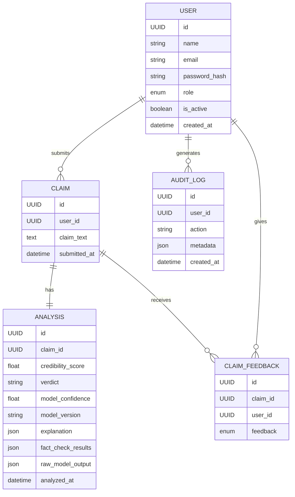
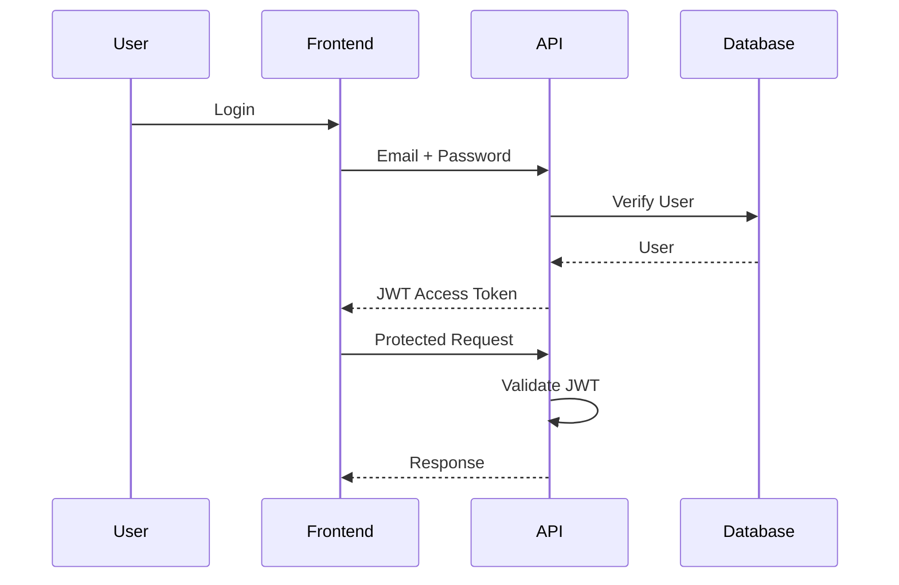
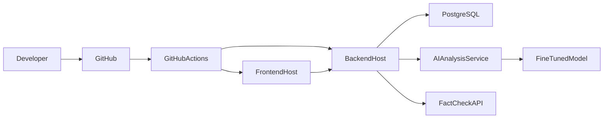

# ARCHITECTURE.md

> **Project:** InfoTrust
> **Version:** 1.1
> **Document Type:** Software Architecture Document
> **Status:** Draft v1.1
> **Architecture Style:** Clean Architecture + Modular Monolith
> **Last Updated:** July 2026

---

# Table of Contents

1. System Overview
2. Architecture Goals
3. Architectural Principles
4. Technology Stack
5. High-Level System Architecture
6. Request Lifecycle
7. Core System Components
8. High-Level Data Flow

> **Note:** Additional sections (Frontend, Backend, AI Layer, Database, Security, Deployment, etc.) will be added in subsequent parts.

---

# 1. System Overview

## Purpose

InfoTrust is an AI-powered misinformation detection and claim analysis platform designed to help users evaluate the credibility of textual claims through transparent, explainable, and evidence-based analysis.

Rather than relying solely on a single AI prediction, InfoTrust combines multiple credibility signals using a **Hybrid Credibility Engine** to produce a more reliable assessment.

These signals include:

* AI prediction using an InfoTrust-specific fine-tuned misinformation classification model
* External fact-check results
* Narrative Activity (similar claim detection)
* Rule-based heuristics

The Hybrid Credibility Engine combines these signals to generate:

* Credibility Score
* Credibility Category
* Explainability Panel

The platform also maintains a history of user analyses and provides administrative tools for platform management.

---

## Primary Objectives

The architecture should:

* Be modular.
* Be maintainable.
* Be secure.
* Be scalable.
* Be understandable.
* Support future enhancements.
* Remain feasible for a single developer.

---

# 2. Architecture Goals

The architecture has been designed around the following goals.

---

## Goal 1 — Simplicity

The project should remain understandable for:

* The developer
* Project supervisor
* University examiners
* Future contributors

Complexity should exist only where it provides meaningful value.

---

## Goal 2 — Maintainability

Each module should have clearly defined responsibilities.

Changes to one module should have minimal impact on others.

---

## Goal 3 — Modularity

Every major feature should exist as an independent module.

Examples:

* Authentication
* Claims
* AI Analysis Service
* Narrative Engine
* Explainability

Modules communicate through clearly defined interfaces.

---

## Goal 4 — Scalability

Although the MVP is a Modular Monolith, the architecture should support future growth.

Potential future enhancements include:

* Improved or replacement fine-tuned classification models
* Alternative compatible classification models
* Image analysis
* URL analysis
* Browser extension
* Public API

These additions should not require major architectural changes.

---

## Goal 5 — Security

Security is treated as a first-class architectural concern.

The system should protect:

* User accounts
* Submitted claims
* Administrative actions
* API endpoints

---

## Goal 6 — Explainability

Explainability is a core architectural requirement.

Every credibility assessment should be accompanied by sufficient explanation, confidence information, and supporting evidence so that users can understand how the final result was generated.

---

# 3. Architectural Principles

InfoTrust follows the following engineering principles.

---

## Clean Architecture

Business logic should remain independent of:

* UI
* Frameworks
* Databases
* External APIs

This makes the application easier to maintain and test.

---

## SOLID Principles

The project follows all five SOLID principles.

Most importantly:

* Single Responsibility Principle
* Dependency Inversion Principle

---

## Separation of Concerns

Each architectural layer should have a single responsibility.

Example:

```text
Frontend
    ↓
REST API
    ↓
Business Logic
    ↓
Database
```

No layer should bypass another without explicit justification.

---

## Feature-Based Organization

Instead of organizing code by technical type alone, the project will be organized around features.

Example:

```text
authentication/
claims/
dashboard/
admin/
```

rather than one large folder containing all controllers or models.

---

## Explicit Dependencies

Every dependency should be visible.

Avoid hidden coupling between modules.

---

## Low Coupling

Modules should depend on interfaces rather than implementation details whenever practical.

---

## High Cohesion

Each module should contain closely related functionality.

Example:

Everything related to claims belongs within the Claims module.

---

# 4. Technology Stack

The selected technology stack prioritizes:

* Open-source software
* Free hosting options
* Strong community support
* Long-term maintainability
* Industry relevance

---

## Frontend

| Technology   | Purpose      | Why Chosen                                         |
| ------------ | ------------ | -------------------------------------------------- |
| React        | UI Framework | Component-based architecture and industry standard |
| TypeScript   | Language     | Improves type safety and maintainability           |
| Vite         | Build Tool   | Fast development experience and optimized builds   |
| Tailwind CSS | Styling      | Rapid, consistent, utility-first styling           |
| React Router | Routing      | Client-side navigation                             |
| Axios        | API Client   | Simplified HTTP communication                      |

---

## Backend

| Technology            | Purpose              | Why Chosen                                         |
| --------------------- | -------------------- | -------------------------------------------------- |
| Python                | Programming Language | Excellent AI ecosystem                             |
| Django                | Web Framework        | Secure, mature, batteries-included framework       |
| Django Ninja | REST APIs            | Robust API development with authentication support |
| Simple JWT            | Authentication       | Standard JWT implementation for Django             |

---

## Database

| Technology | Purpose             | Why Chosen                                           |
| ---------- | ------------------- | ---------------------------------------------------- |
| PostgreSQL | Relational Database | Reliability, performance, indexing, and JSON support |

---

## AI Layer

| Component                                 | Purpose                                |
| ----------------------------------------- | -------------------------------------- |
| InfoTrust Fine-tuned Classification Model | AI-based misinformation classification |
| Fact-check API                            | External evidence retrieval            |
| Sentence Embeddings                       | Narrative similarity detection         |
| Rule Engine                               | Deterministic credibility heuristics   |
| Hybrid Credibility Engine                 | Aggregate all credibility signals      |

### Selected AI Model

The MVP uses an **InfoTrust-specific fine-tuned misinformation classification model**.

The target production model will be fine-tuned from the selected `microsoft/deberta-v3-base` base model using the approved cleaned WELFake + FEVER production training strategy. The final production model has completed training and evaluation; application integration remains a separate implementation task. Fine-tuning and experimentation are performed in Google Colab.

The trained model provides an AI prediction and confidence score for a submitted textual claim. This prediction is treated as one input to the Hybrid Credibility Engine rather than the final decision.

The model is accessed through the **AI Analysis Service** rather than being coupled directly to the Hybrid Credibility Engine. Model-specific loading, tokenization, inference, label mapping, and output interpretation remain inside the AI layer so that the underlying model can be retrained, upgraded, or replaced without requiring changes to unrelated parts of InfoTrust.

---

## Deployment

| Component        | Purpose          |
| ---------------- | ---------------- |
| Docker           | Containerization |
| Render / Railway | Backend Hosting  |
| Vercel           | Frontend Hosting |
| Neon PostgreSQL  | Cloud Database   |
| GitHub           | Version Control  |

---

# Why This Stack?

The chosen stack balances:

* Industry relevance
* AI compatibility
* Ease of learning
* Free-tier availability
* Academic suitability
* Long-term maintainability

Alternative architectures (such as a Node.js backend or microservices) were considered but rejected because they would increase complexity without providing proportional value for a single-developer final-year project.

# 5. High-Level System Architecture

InfoTrust follows a **Modular Monolith** architecture with clearly separated layers.



---

## Why Modular Monolith?

Instead of microservices, the MVP uses a Modular Monolith because it provides:

### Advantages

* Simpler deployment
* Easier debugging
* Lower operational complexity
* Faster development
* Easier testing
* Better suited for solo development

Future extraction into microservices remains possible because modules communicate through well-defined service boundaries.

---

# 6. Request Lifecycle

The following sequence illustrates how a claim is processed.



---

## Request Flow Summary

1. User submits a textual claim.
2. Frontend validates the input.
3. Backend validates the request.
4. The claim is stored in the database.
5. The Hybrid Credibility Engine performs the credibility assessment by:

   * Calling the AI Analysis Service (InfoTrust fine-tuned classification model)
   * Retrieving fact-check information (when available)
   * Searching for similar historical claims
   * Applying rule-based heuristics
6. The Hybrid Credibility Engine combines these signals into a final credibility assessment.
7. The completed analysis is stored.
8. Results are returned to the frontend.
9. The UI displays the Credibility Score, Credibility Category, Explainability Panel, and Narrative Activity.

---

# 7. Core System Components

The architecture consists of the following major components.

| Component                 | Responsibility                                               |
| ------------------------- | ------------------------------------------------------------ |
| Frontend                  | User interface and interaction                               |
| REST API                  | HTTP communication                                           |
| Authentication Module     | User identity and access control                             |
| Claim Module              | Claim submission and management                              |
| AI Analysis Service       | AI-based misinformation classification                       |
| Fact-check Service        | Retrieval of external fact-check information                 |
| Narrative Engine          | Detection of similar historical claims                       |
| Rule Engine               | Rule-based credibility heuristics                            |
| Hybrid Credibility Engine | Aggregates all credibility signals into the final assessment |
| Explainability Engine     | Generates human-readable explanations                        |
| Dashboard Module          | User and administrator dashboards                            |
| Database                  | Persistent storage                                           |

Each component has a clearly defined responsibility and communicates through well-defined interfaces.

---

# 8. High-Level Data Flow



---

## Architectural Decisions Made

| Decision                                  | Rationale                                                                                                                                   |
| ----------------------------------------- | ------------------------------------------------------------------------------------------------------------------------------------------- |
| Modular Monolith                          | Simpler for a solo developer while remaining scalable                                                                                       |
| Clean Architecture                        | Keeps business logic independent and maintainable                                                                                           |
| React + Django                            | Mature, well-supported, and AI-friendly ecosystem                                                                                           |
| PostgreSQL                                | Reliable relational database with excellent indexing support                                                                                |
| JWT Authentication                        | Stateless authentication suitable for REST APIs                                                                                             |
| InfoTrust Fine-tuned Classification Model | Provides the project-specific AI misinformation-classification signal while remaining replaceable behind the AI Analysis Service            |
| Hybrid Credibility Engine                 | Combines AI prediction, fact-check results, Narrative Activity, and rule-based heuristics to produce a more reliable credibility assessment |
| Explainability Panel                      | Improves transparency, user trust, and academic value                                                                                       |
| Narrative Activity                        | Differentiates InfoTrust from traditional fact-checking applications through historical claim similarity analysis                           |

---

# End of Part 1
# 9. Frontend Architecture

## Purpose

The frontend is responsible for providing a responsive, intuitive, and accessible user interface that enables users to:

* Authenticate
* Submit textual claims
* View credibility analysis
* Review claim history
* Manage their profile
* Access dashboards

The frontend communicates exclusively with the backend through REST APIs and is responsible only for presentation and user interaction. All AI processing and credibility analysis are performed on the backend.

The frontend should contain **presentation logic only**. Business logic belongs in the backend.

---

# 10. Frontend Design Goals

The frontend architecture is designed around the following principles.

## Goal 1 — Component Reusability

UI elements should be reusable.

Examples:

* Button
* Card
* Modal
* Table
* Badge
* Spinner
* Input

Avoid duplicate UI implementations.

---

## Goal 2 — Feature Isolation

Each feature should contain its own:

* Components
* Pages
* Hooks
* Services
* Types

This minimizes coupling between unrelated features.

---

## Goal 3 — Predictable State

Local state should remain local.

Global state should only be used when necessary.

---

## Goal 4 — Responsive Design

The application should function well on:

* Desktop
* Tablet
* Mobile

Responsive behavior should be considered during implementation rather than added later.

---

## Goal 5 — Accessibility

Every page should support:

* Keyboard navigation
* Screen readers
* Semantic HTML
* Visible focus indicators

---

# 11. Frontend Technology Stack

| Technology      | Purpose          |
| --------------- | ---------------- |
| React           | UI Framework     |
| TypeScript      | Type Safety      |
| Vite            | Build Tool       |
| Tailwind CSS    | Styling          |
| React Router    | Routing          |
| Axios           | HTTP Client      |
| React Hook Form | Form Management  |
| Zod             | Form Validation  |
| Recharts        | Dashboard Charts |

---

## Why These Technologies?

### React

Provides a component-based architecture with a large ecosystem and strong community support.

---

### TypeScript

Improves maintainability through static typing and better tooling.

---

### Tailwind CSS

Enables consistent styling while avoiding large custom CSS files.

---

### React Hook Form + Zod

Offers performant form handling with schema-based validation.

Validation rules can be shared conceptually with backend validation.

---

### Axios

Provides a clean abstraction over HTTP requests with support for interceptors.

---

# 12. Frontend Folder Structure

```text
src/
│
├── app/
│   ├── router/
│   ├── providers/
│   └── layouts/
│
├── features/
│   ├── auth/
│   ├── claims/
│   ├── dashboard/
│   ├── admin/
│   └── profile/
│
├── components/
│   ├── ui/
│   ├── common/
│   └── feedback/
│
├── services/
│
├── hooks/
│
├── utils/
│
├── types/
│
├── constants/
│
├── assets/
│
└── main.tsx
```

---

# Why This Structure?

* Easy to navigate.
* Supports feature growth.
* Promotes reuse.
* Reduces coupling.
* Scales better than type-based organization.

---

# 13. Feature Structure

Each feature should follow a consistent internal layout.

Example:

```text
features/
└── claims/
    ├── components/
    ├── pages/
    ├── hooks/
    ├── services/
    ├── types.ts
    └── index.ts
```

---

## Benefits

* Encapsulation
* Easier maintenance
* Clear ownership
* Improved scalability

---

# 14. Component Hierarchy

The frontend follows a layered component hierarchy.

```mermaid
flowchart TD

App

↓

Layout

↓

Page

↓

Feature Component

↓

Reusable UI Component
```

---

## Example

```text
App
└── Dashboard Layout
      └── Dashboard Page
            ├── Recent Claims
            ├── Statistics Card
            ├── Activity Chart
            └── Quick Actions
```

---

# 15. Routing Architecture

## Public Routes

```text
/
├── /login
└── /register
```

---

## Protected User Routes

```text
/dashboard
/claims
/claims/:id
/profile
```

---

## Protected Admin Routes

```text
/admin
/admin/users
/admin/claims
/admin/analytics
```

---

## Route Protection

Routes should be protected using role-based access control.

```text
Guest

↓

Login

↓

Authenticated User

↓

Admin Check (if required)
```

---

# 16. Layout Architecture

The application uses layout components to provide consistent navigation.

Layouts:

* Public Layout
* User Dashboard Layout
* Admin Dashboard Layout

---

## Public Layout

Contains:

* Navigation Bar
* Footer

---

## User Dashboard Layout

Contains:

* Sidebar
* Header
* Main Content
* User Menu

---

## Admin Layout

Contains:

* Admin Sidebar
* Top Navigation
* Content Area

---

# 17. State Management Strategy

The project intentionally avoids introducing a global state library (such as Redux) for the MVP.

Instead, state is managed using the most appropriate React mechanisms.

### Local Component State

Use for:

* Form inputs
* Dialog visibility
* UI interactions

---

### React Context

Use for:

* Authentication
* Theme (Dark / Light)
* Current User

---

### Server State

API responses should be managed independently from UI state.

Avoid copying server data unnecessarily into global state.

---

# Why Not Redux?

Redux is powerful but introduces additional complexity.

For the current scope of InfoTrust, React Context combined with local state is sufficient and easier to maintain.

If future requirements become more complex, a dedicated state management library can be introduced without major architectural changes.

---

# 18. API Communication Layer

The frontend communicates with the backend exclusively through a centralized API layer.

```mermaid
flowchart LR

UI

↓

API Service

↓

Axios Client

↓

REST API
```

---

## Principles

* No direct API calls inside UI components.
* All HTTP logic resides in service modules.
* Centralized error handling.
* Automatic JWT attachment.
* Automatic token refresh (future enhancement).

---

# 19. Error Handling Strategy

Every page should handle:

* Loading
* Empty
* Error

Examples:

### Loading

* Spinner
* Skeleton

---

### Empty

* "No claims found."

---

### Error

* Retry button
* Friendly message

---

# 20. Form Strategy

All forms should use:

* React Hook Form
* Zod validation

Validation occurs:

1. Client-side
2. Backend
3. Database

Frontend validation improves user experience but is not considered a security mechanism.

---

# 21. UI Component Categories

## Base Components

Reusable primitives:

* Button
* Input
* Textarea
* Card
* Badge
* Modal
* Spinner
* Tooltip

---

## Common Components

Shared application components:

* Navbar
* Sidebar
* Header
* Footer
* Search Bar
* Pagination

---

## Feature Components

Specific to individual features.

### Claims

* ClaimCard
* ClaimForm
* CredibilityBadge
* ExplainabilityPanel
* FactCheckResults
* NarrativeActivityCard

### Dashboard

* StatsCard
* TrendChart
* ActivityList

### Admin

* UserTable
* ClaimTable
* AnalyticsChart

---

# 22. Frontend Architecture Decisions

| Decision                       | Rationale                                                              |
| ------------------------------ | ---------------------------------------------------------------------- |
| React + TypeScript             | Strong typing and maintainability                                      |
| Feature-Based Folder Structure | Easier scaling and organization                                        |
| Tailwind CSS                   | Fast and consistent styling                                            |
| React Hook Form                | Efficient form handling                                                |
| Zod                            | Schema-based validation                                                |
| Axios                          | Centralized HTTP client                                                |
| React Context                  | Sufficient for MVP state management                                    |
| No Redux                       | Avoid unnecessary complexity                                           |
| Centralized API Layer          | Cleaner separation of concerns                                         |
| Layout Components              | Consistent navigation and UI                                           |
| Backend-driven AI Analysis     | Keeps AI processing independent of the frontend                        |
| Presentation-only Frontend     | Business logic and credibility analysis remain entirely on the backend |

---

# End of Part 2
# 23. Backend Architecture

## Purpose

The backend is responsible for:

* User authentication
* Claim management
* AI analysis orchestration
* Hybrid credibility analysis
* Data persistence
* Authorization
* Administrative functionality
* API delivery

The backend acts as the central coordinator for all business operations.

---

# 24. Backend Design Goals

The backend architecture is designed to achieve the following objectives.

## Goal 1 — Business Logic Isolation

Business rules should never exist inside:

* Views
* Serializers
* Models

Business logic belongs exclusively in the Service Layer.

---

## Goal 2 — Modular Design

Each feature should be implemented as an independent Django app.

Examples:

* Authentication
* Claims
* AI Analysis
* Dashboard
* Administration

---

## Goal 3 — Thin API Layer

Views should:

* Authenticate requests
* Validate input
* Call services
* Return responses

Views should **not** implement business rules.

---

## Goal 4 — Scalability

New modules should be addable without modifying unrelated parts of the application.

---

## Goal 5 — Testability

Business logic should be testable independently of HTTP requests.

---

# 25. Backend Technology Stack

| Technology            | Purpose                |
| --------------------- | ---------------------- |
| Python                | Primary Language       |
| Django                | Web Framework          |
| Django Ninja | REST APIs              |
| PostgreSQL            | Database               |
| Simple JWT            | Authentication         |
| Gunicorn              | Production WSGI Server |
| Docker                | Containerization       |

---

# 26. Django Project Structure

```text
backend/
│
├── config/
│   ├── settings/
│   ├── urls.py
│   ├── wsgi.py
│   └── asgi.py
│
├── apps/
│   ├── authentication/
│   ├── claims/
│   ├── ai/
│   ├── dashboard/
│   ├── administration/
│   └── common/
│
├── shared/
│   ├── exceptions/
│   ├── permissions/
│   ├── middleware/
│   ├── utils/
│   └── constants/
│
├── requirements/
│
├── manage.py
│
└── Dockerfile
```

---

## Why This Structure?

### apps/

Contains all business features.

---

### shared/

Contains reusable infrastructure used across multiple apps.

---

### config/

Contains project configuration.

---

# 27. Internal App Structure

Every Django app should follow a consistent structure.

Example:

```text
claims/
│
├── models.py
├── schemas.py
├── views.py
├── urls.py
├── services.py
├── permissions.py
├── selectors.py
├── validators.py
├── admin.py
└── tests/
```

---

## File Responsibilities

### models.py

Database models only.

No business logic.

---

### schemas.py

Request validation.

Response serialization.

---

### views.py

HTTP layer only.

Should remain small.

---

### services.py

Business logic.

Examples:

* Submit claim
* Run credibility analysis
* Store analysis

---

### selectors.py

Read-only database queries.

Examples:

* Fetch user claims
* Retrieve dashboard statistics

This separates reads from business logic.

---

### validators.py

Reusable validation logic.

---

### permissions.py

Feature-specific authorization rules.

---

# 28. Service Layer Pattern

The Service Layer contains business logic.

Example flow:

```mermaid
flowchart LR

View

↓

Serializer

↓

Service

↓

Model / External API
```

---

## Example

```text
ClaimView

↓

ClaimSerializer

↓

ClaimService.submit_claim()

↓

HybridCredibilityEngine.analyze()

↓

Save Result
```

---

## Benefits

* Testable.
* Reusable.
* Framework-independent logic.
* Easier debugging.

---

# 29. Repository / Selector Pattern

For the MVP, Django ORM is used directly.

However, complex read operations should use **Selectors**.

Example:

```text
selectors.py
```

Responsibilities:

* Optimized queries
* Filtering
* Aggregations
* Dashboard statistics

This prevents ORM logic from spreading throughout the application.

---

## Data Access Flow

```text
Service

↓

Selector / ORM

↓

Database
```

No direct database access from views.

---

# 30. Authentication Architecture

The backend uses JWT-based authentication.

Authentication flow:

```mermaid
flowchart LR

Login

↓

Validate Credentials

↓

Generate JWT

↓

Return Access Token

↓

Authenticated Requests

↓

Protected Endpoint
```

---

## Why JWT?

Advantages:

* Stateless
* Scalable
* REST-friendly
* Easy frontend integration

---

## Authentication Responsibilities

The authentication module manages:

* Registration
* Login
* Logout
* Password hashing
* Token generation
* Token validation

---

# 31. Authorization Strategy

Authorization is Role-Based Access Control (RBAC).

Supported roles:

* Guest
* User
* Admin

---

## Access Matrix

| Resource            | Guest | User | Admin |
| ------------------- | :---: | :--: | :---: |
| Public Pages        |   ✅   |   ✅  |   ✅   |
| Submit Claim        |   ❌   |   ✅  |   ✅   |
| Own Claims          |   ❌   |   ✅  |   ✅   |
| Other Users' Claims |   ❌   |   ❌  |   ✅   |
| Admin Dashboard     |   ❌   |   ❌  |   ✅   |

Authorization is enforced on the backend.

---

# 32. Middleware Strategy

Custom middleware responsibilities include:

* Request logging
* Exception handling
* Security headers
* Request timing (optional)
* Audit logging (future)

Middleware should remain lightweight.

---

# 33. Exception Handling

A centralized exception handler ensures consistent API responses.

Example error format:

```json
{
  "success": false,
  "message": "Claim not found.",
  "error_code": "CLAIM_NOT_FOUND"
}
```

Benefits:

* Predictable client behavior
* Easier debugging
* Consistent API design

---

# 34. API Versioning

All endpoints will be versioned.

Example:

```text
/api/v1/
```

Future versions:

```text
/api/v2/
```

Versioning prevents breaking existing clients when APIs evolve.

---

# 35. Business Logic Principles

Business logic should be:

* Stateless where practical
* Reusable
* Independent of HTTP
* Independent of UI
* Easy to test

Example responsibilities:

* Claim submission workflow
* Triggering the AI Analysis Service, which invokes the currently configured InfoTrust fine-tuned classification model
* Fact-check retrieval
* Narrative Activity detection
* Rule-based analysis
* Hybrid credibility score calculation
* Credibility category generation
* Explainability generation

---

# 36. Backend Architecture Decisions

| Decision                                  | Rationale                                                                                                                       |
| ----------------------------------------- | ------------------------------------------------------------------------------------------------------------------------------- |
| Django                                    | Mature, secure, AI-friendly framework                                                                                           |
| Django Ninja                     | Industry-standard REST API toolkit                                                                                              |
| Feature-Based Apps                        | Better organization and scalability                                                                                             |
| Service Layer                             | Keeps business logic separate from HTTP                                                                                         |
| Selector Pattern                          | Cleaner read operations and future optimization                                                                                 |
| JWT Authentication                        | Stateless and frontend-friendly                                                                                                 |
| Hybrid Credibility Engine                 | Combines multiple credibility signals into a single assessment                                                                  |
| InfoTrust Fine-tuned Classification Model | Fine-tuned misinformation classifier used behind the AI Analysis Service and kept replaceable through a stable service contract |
| API Versioning                            | Future compatibility                                                                                                            |
| Centralized Exception Handling            | Consistent client experience                                                                                                    |
| Thin Views                                | Improved maintainability and testability                                                                                        |

---

# End of Part 3
# 37. Hybrid Credibility Engine

## Purpose

The Hybrid Credibility Engine is the core decision-making component of InfoTrust.

Its responsibility is to aggregate multiple credibility signals into a single, explainable assessment.

Rather than relying solely on a single AI model, the engine combines the standardized prediction returned by the AI Analysis Service with external fact-check evidence, narrative activity, and deterministic rule-based heuristics to produce a transparent credibility assessment.

The Hybrid Credibility Engine depends on the standardized output of the AI Analysis Service rather than on a particular model implementation. This ensures that the underlying fine-tuned classification model can be retrained, upgraded, or replaced without requiring changes to the Hybrid Credibility Engine.

---

# 38. Design Goals

The Hybrid Credibility Engine is designed to:

* Combine multiple credibility signals.
* Reduce dependence on a single source of information.
* Increase transparency.
* Improve explainability.
* Support future signal providers.
* Produce deterministic scoring rules where appropriate.
* Remain extensible.

---

# 39. Analysis Pipeline

Every submitted claim follows the same processing pipeline.



---

# 40. Stage 1 — Input Validation

Responsibilities:

* Empty input check
* Maximum length validation
* Supported language validation (English MVP)
* Remove unnecessary whitespace
* Reject malformed requests

Output:

Validated claim text.

---

# 41. Stage 2 — Claim Normalization

## Purpose

Normalize textual claims before analysis.

Examples:

* Trim whitespace
* Standardize punctuation
* Normalize Unicode
* Lowercase copy for similarity search (retain original for display)

Benefits:

* Improves consistency.
* Enhances similarity detection.
* Reduces duplicate storage issues.

---

# 42. Stage 3 — AI Analysis Service

## Purpose

The AI Analysis Service provides the AI-based misinformation classification signal used by the Hybrid Credibility Engine.

The service invokes the currently configured **InfoTrust-specific fine-tuned misinformation classification model**.

The target production model will be fine-tuned from the selected `microsoft/deberta-v3-base` base model using the approved cleaned WELFake + FEVER production training strategy. The final production model has completed training and evaluation; application integration remains a separate implementation task.

The model provides one credibility signal and does **not** determine the final verdict.

---

## Input

Normalized claim text.

---

## Output

Example:

```json id="6tchd9"
{
  "label": "MISINFORMATION",
  "confidence": 0.91
}
```

The exact internal labels produced by the underlying fine-tuned model may differ.

The AI Analysis Service is responsible for mapping model-specific outputs into the standardized format expected by the Hybrid Credibility Engine.

---

## Responsibilities

The AI Analysis Service shall:

* Receive normalized claim text.
* Prepare the claim for model inference.
* Tokenize the claim where required.
* Invoke the configured fine-tuned classification model.
* Interpret the model output.
* Map model-specific labels into InfoTrust's standardized labels.
* Extract the model confidence score.
* Validate the model output.
* Return a standardized AI signal to the Hybrid Credibility Engine.

---

## Model Replaceability

The Hybrid Credibility Engine must not directly depend on the implementation details of the fine-tuned model.

The architecture should follow:

```text id="jbtbxm"
Hybrid Credibility Engine

↓

AI Analysis Service

↓

Model Adapter / Loader

↓

Configured Fine-tuned Model
```

If the model needs to be replaced:

```text id="31xah3"
Hybrid Credibility Engine

↓

AI Analysis Service

↓

Model Adapter / Loader

↓

Replacement Compatible Model
```

The Hybrid Credibility Engine remains unchanged as long as the replacement model satisfies the standardized AI Analysis Service contract.

Model-specific responsibilities such as:

* Model loading
* Tokenization
* Input preparation
* Inference
* Label mapping
* Confidence extraction
* Raw output interpretation

must remain isolated inside the AI layer.

This prevents model-specific implementation details from spreading into unrelated application components.

---

# 43. Stage 4 — Fact-check Service

## Purpose

Search trusted fact-check sources for evidence related to the claim.

---

## Responsibilities

The service should:

* Search available fact-check APIs.
* Identify relevant fact-check results.
* Extract:

  * Claim text
  * Rating
  * Publisher
  * Review date
  * Source URL

---

## Example Output

```json id="ljjpxf"
{
  "matches": 2,
  "sources": [
    {
      "publisher": "Example Fact Check",
      "rating": "False",
      "url": "https://example.com"
    }
  ]
}
```

---

## Failure Handling

If the Fact-check Service is unavailable:

* Continue analysis.
* Reduce confidence.
* Log the failure.
* Do not fail the entire request.

---

# 44. Stage 5 — Narrative Engine

## Purpose

Identify similar claims previously submitted to InfoTrust.

---

## Process

```text id="3v1o1n"
Claim

↓

Generate Embedding

↓

Compare Against Historical Claims

↓

Calculate Similarity

↓

Return Matches
```

---

## Example Output

```json id="2jzjga"
{
  "similar_claims": 18,
  "first_seen": "2026-02-12",
  "last_seen": "2026-05-04",
  "similarity_score": 0.91
}
```

---

## Interpretation

Narrative Activity does **not** determine whether a claim is true or false.

It provides contextual information about:

* Repetition
* Spread
* Recurrence
* Historical patterns

---

# 45. Stage 6 — Rule Engine

## Purpose

Apply deterministic credibility heuristics.

Rules may include:

* Excessive capitalization
* Sensational language
* Duplicate punctuation
* Clickbait phrases
* Extremely short claims
* Suspicious wording

---

## Example

```text id="u9ob6j"
"BREAKING!!! GOVERNMENT HIDES SECRET CURE!!!"
```

Flags:

```text id="rks04u"
excessive_capitalization = true
duplicate_punctuation = true
sensational_language = true
```

---

## Rule Output

```json id="udwrrs"
{
  "flags": 3,
  "credibility_penalty": 0.15
}
```

---

# 46. Stage 7 — Signal Aggregator

The Signal Aggregator combines outputs from:

* AI Analysis Service
* Fact-check Service
* Narrative Engine
* Rule Engine

---

## Initial Weighting Strategy

| Signal              | Weight |
| ------------------- | -----: |
| Fact-check Evidence |    40% |
| AI Analysis         |    35% |
| Narrative Activity  |    15% |
| Rule Engine         |    10% |

---

## Why These Weights?

* Fact-check evidence is considered the strongest external signal.
* The AI Analysis Service provides the primary AI prediction from the configured fine-tuned classification model.
* Narrative Activity supplies historical context.
* Rule-based heuristics complement the overall assessment.

Weights should remain configurable rather than hard-coded.

Replacing or retraining the underlying fine-tuned classification model does **not** automatically change these weights.

Any future adjustment to the weighting strategy should be treated as a separate project decision and should ideally be supported by evaluation results.

---

# 47. Stage 8 — Credibility Score

The Signal Aggregator produces a normalized score between **0 and 100**.

Example mapping:

|  Score | Interpretation       |
| ------ | -------------------  |
| 70–100 | Likely Credible      |
| 40-69  | Uncertain            |
|  0–39  | Likely Misinformation|

---

## Design Principle

The score represents an AI-assisted credibility assessment rather than a guarantee of factual correctness.

---

# 48. Stage 9 — Verdict Generation

The verdict is derived directly from the final credibility score.

Possible verdicts:

* Likely Credible
* Uncertain
* Likely Misinformation

The verdict remains deterministic based on predefined score thresholds.

---

# 49. Stage 10 — Explainability Engine

## Purpose

Convert technical analysis into a human-readable explanation.

---

## Responsibilities

Display:

* Overall verdict
* Credibility score
* AI model prediction
* Fact-check findings
* Narrative Activity summary
* Rule-based observations

---

Example structure:

```text id="dh4k4v"
Verdict:
Likely Misinformation

Why?

• The AI analysis classified this claim as likely misinformation with high confidence.
• Two trusted fact-check sources dispute this claim.
• Similar versions have appeared 18 times previously.
• The wording contains sensational language.
```

---

## Design Goal

Users should understand why the system reached its conclusion without requiring technical knowledge.

The Explainability Engine should describe the contribution of the AI analysis without requiring users to understand the implementation details of the underlying fine-tuned model.

---

# 50. End-to-End Analysis Flow



---

# 51. Extensibility

The Hybrid Credibility Engine is designed to support additional credibility signals without major architectural changes.

Future enhancements may include:

* URL analysis
* Image analysis
* Source reputation
* User reputation
* Improved fine-tuned classification models
* Alternative compatible classification models
* Temporal consistency analysis

Each new signal should provide a normalized confidence score for aggregation.

The underlying classification model may also be retrained, upgraded, or replaced independently through the AI Analysis Service without redesigning the Hybrid Credibility Engine.

---

# 52. Architecture Decisions

| Decision                                               | Rationale                                                                                         |
| ------------------------------------------------------ | ------------------------------------------------------------------------------------------------- |
| Fine-tuned classification model is advisory            | Avoids dependence on a single prediction                                                          |
| AI Analysis Service abstracts the classification model | Prevents the Hybrid Credibility Engine from becoming coupled to a specific model implementation   |
| Classification model remains replaceable               | Allows retraining, upgrading, or replacement without redesigning unrelated application components |
| Fact-check evidence receives the highest weight        | External verified evidence is generally the most reliable signal                                  |
| Narrative Activity provides context only               | Prevents repetition from being interpreted as truth                                               |
| Rule Engine remains deterministic                      | Transparent and easy to explain                                                                   |
| Configurable weights                                   | Allows future tuning without code changes                                                         |
| Deterministic verdict thresholds                       | Ensures consistent results for identical inputs                                                   |
| Explainability is a first-class feature                | Improves transparency and academic value                                                          |

---

# End of Part 4

## Analysis Execution Model

Claim analysis is treated as an asynchronous application workflow.

1. The claim is validated and persisted with status `PENDING`.
2. Analysis processing is triggered after claim creation.
3. The analysis workflow changes the claim status to `PROCESSING`.
4. The AI Analysis Service, Fact-check Service, Narrative Activity Engine, and Rule Engine produce their signals.
5. The Hybrid Credibility Engine calculates the final result.
6. The analysis and explainability data are persisted.
7. The claim status becomes `COMPLETED`, or `FAILED` when processing cannot complete.
8. The frontend retrieves the status and then the completed analysis.

The public API must not require clients to wait for the complete inference pipeline during the initial claim-submission request.


# 53. Database Architecture

## Purpose

The database is responsible for storing:

* User accounts
* Submitted claims
* AI analysis results
* Fact-check evidence
* Narrative metadata
* User feedback
* Administrative data

The design follows normalization principles while allowing efficient retrieval for common application workflows.

---

# 54. Database Technology

## Database Engine

PostgreSQL

---

## Why PostgreSQL?

Advantages:

* ACID compliant
* Excellent indexing
* JSON support
* Strong performance
* Mature ecosystem
* Free
* Widely used in industry

---

# 55. Database Design Principles

The schema follows these principles:

* Normalize until practical (approximately 3NF)
* Avoid duplicated data
* Prefer foreign keys over duplicated fields
* Soft-delete where appropriate
* Timestamp all important entities
* Use UUIDs as primary keys
* Design for future extensibility

---

# 56. High-Level ER Diagram



---

# 57. Core Tables

## 1. Users

### Purpose

Store registered users.

### Columns

* id
* full_name
* email
* password_hash
* role
* is_active
* created_at
* updated_at

### Indexes

* email UNIQUE

---

## 2. Claims

### Purpose

Store user-submitted textual claims.

### Columns

* id
* user_id
* claim_text
* submitted_at

### Indexes

* user_id
* submitted_at

---

## 3. Analyses

### Purpose

Store the complete credibility analysis generated after processing a claim.

### Columns

* id
* claim_id
* credibility_score
* verdict
* model_confidence
* model_version
* explanation
* fact_check_results
* raw_model_output
* analyzed_at

---

### Why Separate Analysis?

Each submitted claim has one analysis record in the MVP.

The Analysis table stores:

* Fine-tuned model prediction
* Model confidence score
* Model version
* Hybrid credibility score
* Verdict
* Explainability output
* Fact-check evidence
* Raw model response

Storing the model version allows an analysis to remain traceable to the model version that generated its AI prediction.

This is important because the underlying fine-tuned classification model is intentionally replaceable. Existing analyses should remain reproducible and understandable even after a newer model is deployed.

Future versions may support replacement or multiple compatible classification models without redesigning the schema.

---

## 4. Claim Feedback

### Purpose

Store user feedback.

### Columns

* id
* user_id
* claim_id
* feedback

### Values

* HELPFUL
* NOT_HELPFUL

### Constraint

One feedback per user per claim.

---

## 5. Audit Logs

### Purpose

Track important administrative actions.

Examples

* User disabled
* Claim deleted
* Login event
* Profile update

---

# 58. Future Tables

The following tables are intentionally excluded from the MVP but can be added later without redesign.

## Narrative Matches

Purpose

Persist semantic similarity results.

---

## Fact-check Cache

Purpose

Cache external fact-check API responses to reduce repeated requests.

---

## AI Models

Purpose

Support model versioning, model metadata, and multiple compatible classification models if future experimentation or model comparison is introduced.

The table may eventually store information such as:

* Model identifier
* Model version
* Base model
* Training dataset reference
* Deployment status
* Evaluation metrics
* Created date

This table is not required for the MVP because lightweight model version information can be stored directly with the Analysis record.

---

## API Usage

Purpose

Track inference requests, response times, and usage statistics.

---

## Notifications

Purpose

Future notification system.

---

# 59. Relationships

User

↓

Claims

One-to-Many

---

Claim

↓

Analysis

One-to-One

---

Claim

↓

Feedback

One-to-Many

---

User

↓

Feedback

One-to-Many

---

User

↓

Audit Logs

One-to-Many

---

# 60. Primary Keys

Every table uses:

UUID

Reasons:

* Harder to guess
* Better for APIs
* Easier future replication
* Better security

---

# 61. Foreign Keys

Claims

user_id

→ Users

---

Analysis

claim_id

→ Claims

---

Feedback

claim_id

→ Claims

---

Feedback

user_id

→ Users

---

Audit Logs

user_id

→ Users

---

# 62. Constraints

Users

* email UNIQUE

---

Claims

* claim_text NOT NULL

---

Analysis

* credibility_score BETWEEN 0 AND 100
* model_confidence BETWEEN 0 AND 1

---

Feedback

UNIQUE

(user_id, claim_id)

---

Role

Allowed values:

* USER
* ADMIN

---

Verdict

Allowed values:

* CREDIBLE
* UNCERTAIN
* MISINFORMATION

---

# 63. Indexing Strategy

Indexes improve search performance.

Recommended indexes:

Users

* email

Claims

* user_id
* submitted_at

Analysis

* credibility_score
* verdict

Audit Logs

* created_at

---

## Future Indexes

If Narrative Activity becomes large:

* pgvector embedding index
* cosine similarity index

These are intentionally deferred.

---

# 64. Validation Rules

### User

* Valid email
* Password complexity
* Unique email

---

### Claim

* Not empty
* Maximum length
* Plain text only

---

### Analysis

* Score between 0–100
* Model confidence between 0–1
* Valid verdict

---

### Feedback

Must be one of:

* HELPFUL
* NOT_HELPFUL

---

# 65. Data Lifecycle

Claim Submission

↓

Stored

↓

AI Analysis Service

↓

Configured Fine-tuned Classification Model

↓

Standardized AI Prediction

↓

Fact-check API Retrieval

↓

Narrative Similarity Analysis

↓

Rule Engine Evaluation

↓

Hybrid Credibility Score Calculation

↓

Analysis Saved

↓

Displayed to User

↓

Feedback Recorded

↓

Available in History

Deleted claims should be soft-deleted where possible to preserve auditability.

The model version associated with the AI prediction should remain stored with the analysis so that historical results remain traceable even if the configured classification model is later replaced.

---

# 66. Expandability

The schema is intentionally designed to support future enhancements.

Future additions include:

* Improved fine-tuned classification models
* Alternative compatible classification models
* Model version tracking
* Image analysis
* URL analysis
* Cached fact-check responses
* User reputation
* Source reputation
* Narrative embedding storage

These additions should not require major changes to existing tables.

The model-specific implementation remains isolated behind the AI Analysis Service, while the database stores standardized outputs and lightweight model-version information. This allows the underlying model to change without requiring redesign of unrelated database entities.

---

# 67. Database Architecture Decisions

| Decision                                                 | Rationale                                                                     |
| -------------------------------------------------------- | ----------------------------------------------------------------------------- |
| PostgreSQL                                               | Reliable relational database with excellent indexing                          |
| UUID primary keys                                        | Security and scalability                                                      |
| Separate Analysis table                                  | Preserves analysis independently from claims                                  |
| Store raw model output                                   | Supports explainability and future recalibration                              |
| JSON fields for explanations and fact-check results      | Flexible schema for evolving AI outputs                                       |
| Store model confidence separately                        | Enables hybrid credibility score calculation                                  |
| Store model version with analysis                        | Preserves traceability when the fine-tuned model is retrained or replaced     |
| Keep model-specific details outside core business tables | Supports model replaceability without coupling the database to one classifier |
| Unique feedback constraint                               | Prevents duplicate votes                                                      |
| Soft-delete strategy                                     | Preserves audit history                                                       |
| Timestamp all entities                                   | Enables analytics and debugging                                               |

---

# End of Part 5
# 68. Security Architecture

## Purpose

The Security Architecture defines how InfoTrust protects:

* User identities
* Submitted claims
* Administrative functionality
* AI Analysis Service
* Fine-tuned classification model
* External Fact-check APIs
* Application APIs
* Sensitive configuration
* Stored data

Security is implemented in multiple layers following the principle of **Defense in Depth**.

---

# 69. Security Principles

InfoTrust follows these principles:

* Least Privilege
* Defense in Depth
* Secure by Default
* Input Validation
* Output Encoding
* Fail Securely
* Principle of Separation
* Zero Trust Between Layers

No client-side validation is trusted.

Every request is validated again on the backend.

---

# 70. Authentication Architecture

Authentication is implemented using:

* Email
* Password
* JWT Access Token

The backend remains stateless.

---

## Authentication Flow



---

## Login Process

1. User submits credentials.
2. Credentials are validated.
3. Password is verified.
4. JWT is generated.
5. JWT is returned.
6. Frontend stores the token.
7. Future requests include the Authorization header.

---

# 71. Password Security

Passwords are never stored in plaintext.

Requirements:

* Django password hashing
* Strong hashing algorithm (PBKDF2 by default)
* Password complexity validation
* Secure password comparison

Minimum password policy:

* Minimum 8 characters
* Uppercase letter
* Lowercase letter
* Number
* Special character

---

# 72. Authorization

InfoTrust uses Role-Based Access Control (RBAC).

Roles:

* Guest
* User
* Admin

---

## Permission Matrix

| Resource        | Guest |     User     | Admin |
| --------------- | :---: | :----------: | :---: |
| Landing Page    |   ✅   |       ✅      |   ✅   |
| Register        |   ✅   |       ❌      |   ❌   |
| Login           |   ✅   |       ❌      |   ❌   |
| Submit Claim    |   ❌   |       ✅      |   ✅   |
| Claim History   |   ❌   | ✅ (Own Only) |   ✅   |
| Profile         |   ❌   | ✅ (Own Only) |   ✅   |
| Admin Dashboard |   ❌   |       ❌      |   ✅   |
| Manage Users    |   ❌   |       ❌      |   ✅   |
| Delete Claims   |   ❌   |       ❌      |   ✅   |

Authorization is enforced by the backend.

Frontend route protection improves user experience but is not treated as a security boundary.

---

# 73. JWT Strategy

The frontend sends:

```http
Authorization: Bearer <access_token>
```

Every protected endpoint validates:

* Signature
* Expiration
* User existence
* User active status

Expired or invalid tokens result in:

* HTTP 401 Unauthorized

---

## Refresh Tokens

For the MVP:

* Access Token
* Refresh Token

Access tokens should be short-lived.

Refresh tokens should have a longer validity.

This improves both usability and security.

---

# 74. Input Validation Strategy

Validation occurs at three levels.

## Level 1 — Frontend

Purpose:

Improve user experience.

Examples:

* Required fields
* Character limits
* Email format

Frontend validation is never considered sufficient for security.

---

## Level 2 — API

Purpose:

Protect backend services.

Validation includes:

* Required fields
* Data types
* Length limits
* Enum validation
* Claim text validation

All user-controlled data must be validated before being passed to internal services.

---

## Level 3 — Database

Purpose:

Protect data integrity.

Examples:

* NOT NULL
* UNIQUE
* Foreign Keys
* CHECK constraints

---

# 75. API Security

Every API endpoint should:

* Validate authentication
* Validate authorization
* Validate input
* Return consistent errors
* Never expose stack traces
* Avoid exposing internal implementation details
* Restrict administrative operations to authorized users

Example:

Good:

```json
{
  "success": false,
  "message": "Authentication required."
}
```

Bad:

```text
Traceback...
DatabaseError...
```

Internal model implementation details should not be exposed through public API responses unless required for an explicit user-facing explainability feature.

---

# 76. CSRF Strategy

Because InfoTrust uses JWT for authentication:

* CSRF protection is not required for JWT-protected APIs when tokens are sent in the `Authorization` header.
* Django's CSRF protection remains enabled for any session-based endpoints, such as Django Admin if used.

---

# 77. XSS Protection

To reduce Cross-Site Scripting risks:

* React automatically escapes rendered content.
* Do not use `dangerouslySetInnerHTML` unless absolutely necessary.
* Sanitize any HTML received from external sources before rendering.
* Treat external Fact-check API content as untrusted data.

Submitted claim text must be rendered as text rather than executable markup.

---

# 78. SQL Injection Protection

SQL Injection is mitigated by:

* Django ORM
* Parameterized queries
* Avoiding raw SQL unless necessary

Never concatenate user input into SQL statements.

If raw SQL becomes necessary, all values must be parameterized.

---

# 79. Rate Limiting

## Purpose

Prevent abuse and protect resource-intensive operations.

Examples:

### Login

* 5 attempts per minute per IP (configurable)

### Claim Analysis

* Reasonable request limits should be applied to prevent excessive model inference.
* Limits should also protect external Fact-check API quotas.
* Limits should prevent a single user from consuming excessive server resources.

Future implementations may use packages such as `django-ratelimit` or reverse proxy rate limiting.

Exact limits should remain configurable rather than hard-coded.

---

# 80. Environment Variable Security

Sensitive values must never be committed to source control.

Examples:

* Django Secret Key
* Database URL
* Fact-check API Key
* JWT Secret
* Debug Flag
* External service credentials

All secrets should be loaded from environment variables.

The fine-tuned model itself does not require an external API token when hosted as part of the application's controlled inference environment.

If model hosting is moved to an external inference provider in the future, any required authentication credentials must also be stored exclusively through secure environment configuration.

Files such as:

```text
.env
.env.production
```

must never be committed to Git.

A safe example file may be maintained:

```text
.env.example
```

It should contain variable names only and never real secrets.

---

# 81. Logging Strategy

Log important events such as:

* Successful login
* Failed login
* User registration
* Claim submission
* Model inference requests
* Model inference failures
* Fact-check API requests
* Admin actions
* Unexpected server errors

Model-related logs may include non-sensitive operational metadata such as:

* Model version
* Inference duration
* Success or failure status

Do **not** log:

* Passwords
* JWTs
* API keys
* Database credentials
* Sensitive personal data
* Complete secret configuration

Logs should contain enough information for debugging without exposing credentials or unnecessary user information.

---

# 82. Audit Logging

Administrative actions should be recorded.

Examples:

* User disabled
* User enabled
* Claim deleted
* Role changed

Each audit entry should include:

* Actor
* Action
* Target
* Timestamp

Audit logs should not be editable through normal user-facing operations.

---

# 83. Error Handling

The API should return standardized error responses.

Example:

```json
{
  "success": false,
  "error": {
    "code": "CLAIM_NOT_FOUND",
    "message": "The requested claim does not exist."
  }
}
```

Benefits:

* Easier frontend integration
* Predictable client behavior
* Better debugging
* Reduced exposure of internal implementation details

Internal exceptions should be logged on the server while users receive safe error messages.

---

# 84. Security Headers

Recommended HTTP headers:

* Content-Security-Policy (CSP)
* X-Content-Type-Options
* Referrer-Policy
* Permissions-Policy
* X-Frame-Options

These can be configured using Django security middleware and appropriate supporting packages.

CORS configuration should explicitly allow only trusted frontend origins in production.

Development origins should not automatically be carried into production configuration.

---

# 85. AI Security Considerations

The AI Analysis Service introduces additional security and reliability considerations.

Mitigation strategies:

* Validate claim length before model inference.
* Validate the claim format before preprocessing.
* Do not pass unnecessary user information to the model.
* Treat submitted claim text as untrusted input.
* Validate preprocessing output before inference.
* Validate model output before using it in the Hybrid Credibility Engine.
* Ensure prediction confidence remains within the expected range.
* Handle model inference failures gracefully.
* Apply inference timeouts where appropriate.
* Prevent uncontrolled resource consumption through rate limiting.
* Keep model files and configuration under controlled backend access.
* Never expose internal model storage paths or infrastructure details to the frontend.
* Handle Fact-check API failures gracefully.
* Validate external Fact-check API responses before storing or displaying them.
* Treat all external API responses as untrusted until validated.

---

## Model Isolation

The fine-tuned misinformation classification model must be accessed only through the **AI Analysis Service**.

Other components should not communicate directly with the underlying model implementation.

Architecture:

```text
Hybrid Credibility Engine
        ↓
AI Analysis Service
        ↓
Model Adapter
        ↓
Configured Fine-tuned Model
```

The service exposes a standardized output such as:

```json
{
  "prediction": "MISINFORMATION",
  "confidence": 0.91
}
```

The rest of the application depends on this standardized contract rather than a specific model implementation.

---

## Security Benefit of Model Isolation

Model isolation prevents the rest of the application from becoming tightly coupled to:

* Model architecture
* Model storage location
* Tokenizer implementation
* Model framework
* Model version
* Inference infrastructure

If the fine-tuned model is retrained, replaced, or moved to another inference environment, only the model integration layer should require significant modification.

Authentication, claims, Narrative Activity, Fact-check integration, the Rule Engine, Hybrid Credibility Engine, database architecture, and frontend should continue operating through the same AI Analysis Service contract.

---

## Model Output Validation

Model predictions must be validated before entering the Hybrid Credibility Engine.

Validation should verify:

* Prediction belongs to the expected classification labels.
* Confidence is numeric.
* Confidence is between 0 and 1.
* Required fields are present.
* Invalid or incomplete results are rejected.

The Hybrid Credibility Engine must not blindly trust raw model output.

---

## Model Failure Handling

If the configured classification model becomes unavailable or inference fails:

1. The AI Analysis Service reports the AI signal as unavailable.
2. The failure is logged.
3. Other independent credibility signals may still execute.
4. The Hybrid Credibility Engine handles the missing signal according to its configured aggregation policy.
5. The system must not fabricate a model prediction.

A model failure should therefore degrade the analysis gracefully rather than crash unrelated parts of the application.

This behavior supports the architectural requirement that the ML component remain replaceable and isolated.

---

# 86. File Upload Security

MVP Decision:

InfoTrust supports **text claims only**.

Therefore:

* No file uploads.
* No image uploads.
* No document uploads.

This significantly reduces the attack surface.

If file or image analysis is introduced in future versions, a dedicated upload security strategy will be required.

---

# 87. Security Checklist

Before deployment, verify:

* Password hashing enabled
* HTTPS enabled in production
* DEBUG disabled
* Environment variables configured
* Secrets excluded from Git
* JWT validation working
* Authorization tested
* Input validation complete
* Claim length limits enforced
* Error messages sanitized
* Audit logging enabled
* Rate limiting configured
* Database backups scheduled
* CORS restricted to trusted origins
* Security headers configured
* Model inputs validated
* Model outputs validated
* Model failure handling tested
* Model files inaccessible from public routes
* Fact-check API credentials protected
* External API responses validated

---

# 88. Security Architecture Decisions

| Decision                                  | Rationale                                                                           |
| ----------------------------------------- | ----------------------------------------------------------------------------------- |
| JWT Authentication                        | Stateless and suitable for REST APIs                                                |
| RBAC                                      | Simple, effective access control                                                    |
| Multi-layer validation                    | Prevents invalid or malicious input                                                 |
| Django ORM                                | Protects against SQL injection                                                      |
| React default escaping                    | Helps mitigate XSS                                                                  |
| Environment variables                     | Prevent secret leakage                                                              |
| Backend-only external service credentials | Prevents unauthorized access to third-party services                                |
| AI Analysis Service isolation             | Prevents the application from depending directly on a specific model implementation |
| Standardized model interface              | Allows the fine-tuned model to be replaced without affecting unrelated modules      |
| Model input and output validation         | Prevents malformed data from entering the Hybrid Credibility Engine                 |
| Graceful model failure handling           | Prevents ML inference failures from crashing unrelated system components            |
| Model version logging                     | Improves traceability and debugging across model replacements                       |
| Audit logging                             | Accountability for administrative actions                                           |
| Standardized error responses              | Consistent API behavior                                                             |
| Text-only MVP                             | Smaller attack surface and simpler implementation                                   |

---

# End of Part 6
# 89. Deployment Architecture

## Purpose

The Deployment Architecture defines how InfoTrust is developed, tested, and deployed across different environments while ensuring reliability, security, and maintainability.

The deployment strategy prioritizes:

* Reproducibility
* Security
* Simplicity
* Scalability
* Cost-effectiveness

The MVP is designed to run on modern cloud platforms using containerized services.

---

# 90. Deployment Goals

The deployment architecture should:

* Support local development using Docker
* Support cloud deployment
* Keep secrets secure
* Minimize manual configuration
* Enable continuous integration and deployment
* Allow future horizontal scaling
* Support deployment and replacement of the fine-tuned classification model without redesigning unrelated application components

---

# 91. Deployment Environments

InfoTrust uses separate environments to isolate development from production.

## Development

Purpose:

Local development and testing.

Characteristics:

* DEBUG = True
* Docker Compose
* Local PostgreSQL
* Environment variables stored in `.env`
* Hot reloading enabled
* Development model configuration

---

## Production

Purpose:

Public deployment.

Characteristics:

* DEBUG = False
* HTTPS enabled
* Managed PostgreSQL
* Secure environment variables
* Centralized logging
* Production model configuration

---

# 92. High-Level Deployment Architecture



The fine-tuned classification model remains behind the AI Analysis Service.

The frontend and other backend modules do not communicate directly with the underlying model.

---

# 93. Recommended Hosting Stack

## Frontend

Recommended:

**Vercel**

Reasons:

* Native React + Vite support
* Automatic deployments
* Global CDN
* HTTPS by default
* Generous free tier

---

## Backend

Recommended:

**Render**

Alternative:

* Railway

Reasons:

* Excellent Django support
* Docker deployment
* HTTPS
* Environment variable management
* Automatic deployments

The selected backend environment must provide sufficient resources for the configured model inference strategy.

If the fine-tuned model cannot be hosted efficiently inside the main backend deployment, the AI Analysis Service can later be deployed separately while preserving the same internal service contract.

---

## Database

Recommended:

**Neon PostgreSQL**

Reasons:

* Managed PostgreSQL
* Automatic backups
* Free tier
* Serverless architecture
* Easy integration with Django

---

## Source Control

GitHub

Used for:

* Version control
* Pull Requests
* CI/CD
* Issue tracking
* Release history

Large trained model artifacts should not be committed directly to the normal Git repository unless an appropriate model-artifact strategy is intentionally configured.

---

# 94. Containerization

InfoTrust uses Docker to ensure identical environments across development and production.

Benefits:

* Consistent environments
* Faster onboarding
* Simplified deployment
* Reduced dependency conflicts
* Reproducible model dependencies

---

## Docker Services

Development environment:

```text id="docker-services"
Docker Compose

│
├── frontend (React)
├── backend (Django + AI Analysis Service)
└── postgres (Database)
```

For the MVP, the AI Analysis Service may remain part of the backend application rather than becoming a separate microservice.

The fine-tuned model is accessed through this service boundary even when both run inside the same backend deployment.

Future services may include:

* Redis
* Celery Worker
* Celery Beat
* Dedicated Model Inference Service

These are intentionally excluded from the MVP unless required by actual deployment constraints.

---

# 95. Environment Variables

Sensitive configuration must never be committed to source control.

Typical variables include:

```text id="environment-variables"
SECRET_KEY

DEBUG

DATABASE_URL

ALLOWED_HOSTS

MODEL_PATH

MODEL_VERSION

FACT_CHECK_API_KEY

ACCESS_TOKEN_LIFETIME

REFRESH_TOKEN_LIFETIME

CORS_ALLOWED_ORIGINS
```

`MODEL_PATH` identifies the configured model artifact or deployment location.

`MODEL_VERSION` identifies the currently deployed model version and supports traceability when the model is retrained or replaced.

If the model is hosted through an external inference environment in the future, any required credentials should also be supplied securely through environment variables rather than source code.

---

## Environment Files

Development:

```text id="development-env"
.env
```

Production:

Environment variables should be configured using the hosting platform's secret management system.

Model-specific configuration should remain centralized so that changing the underlying model does not require modifications throughout the application.

---

# 96. Build Process

## Frontend

```text id="frontend-build"
Install Dependencies

↓

TypeScript Compilation

↓

Vite Build

↓

Optimized Static Assets
```

---

## Backend

```text id="backend-build"
Install Dependencies

↓

Prepare Model Dependencies

↓

Validate Model Configuration

↓

Run Database Migrations

↓

Collect Static Files

↓

Start Gunicorn
```

The exact model-loading process depends on the final inference strategy.

Model initialization should occur through the AI Analysis Service or its model adapter rather than being duplicated throughout the backend.

---

# 97. CI/CD Strategy

Every push to the `main` branch should trigger an automated pipeline.

Pipeline Steps:

1. Install dependencies
2. Run formatting checks
3. Run linting
4. Execute automated tests
5. Validate AI Analysis Service integration
6. Build frontend
7. Build backend
8. Deploy if all checks succeed

---

## CI/CD Workflow

```mermaid id="cicd-workflow"
flowchart TD

Developer

↓

GitHub

↓

GitHub Actions

↓

Lint

↓

Tests

↓

AIServiceValidation

↓

Build

↓

Deploy

↓

Production
```

A new fine-tuned model version should be validated against the AI Analysis Service contract before replacing the currently deployed model.

This ensures that model replacement does not unexpectedly break the Hybrid Credibility Engine.

---

# 98. Monitoring Strategy

The MVP uses lightweight monitoring.

The system should monitor:

* Server availability
* Database connectivity
* Model inference availability
* Fact-check API failures
* Application errors

---

## Health Endpoint

Provide a lightweight endpoint:

```text id="health-endpoint"
GET /api/v1/health/
```

Example response:

```json id="health-response"
{
  "status": "healthy",
  "database": "connected",
  "model": "available"
}
```

This endpoint assists deployment verification and uptime monitoring.

The health endpoint should not expose:

* Internal model paths
* API credentials
* Infrastructure secrets
* Sensitive configuration

---

# 99. Logging Strategy

Application logs should follow standard logging levels.

Typical levels:

* DEBUG
* INFO
* WARNING
* ERROR
* CRITICAL

Production logs should prioritize:

* Application errors
* Authentication failures
* Model inference failures
* Fact-check API failures
* Database errors
* Deployment-related failures

Model-related logs may include:

* Model version
* Inference success or failure
* Inference duration

Sensitive information should never be written to application logs.

---

# 100. Backup Strategy

Database backups should be automated.

Recommended strategy:

* Daily backups
* Retention managed by the hosting provider
* Point-in-time recovery when supported

Source code is backed up through GitHub.

The trained model artifact should also have a reproducible storage and recovery strategy.

At minimum, the project should retain:

* Model version
* Model artifact or retrievable artifact reference
* Training configuration
* Evaluation results required to identify the deployed version

This ensures that replacing the production model does not permanently remove the ability to identify or restore the previous working version.

---

# 101. Rollback Strategy

If deployment fails:

1. Stop the deployment.
2. Roll back to the previous stable release.
3. Restore the database only if necessary.
4. Investigate logs.
5. Redeploy after fixes.

Database migrations should remain backward compatible whenever practical.

---

## Model Rollback

If a newly deployed fine-tuned model causes problems:

1. Disable the new model version.
2. Restore the previous stable model configuration.
3. Verify the AI Analysis Service contract.
4. Run inference validation.
5. Restore normal claim analysis.

Because the Hybrid Credibility Engine communicates with the model through the AI Analysis Service, model rollback should not require changes to the Hybrid Credibility Engine or other unrelated application modules.

---

# 102. Static Assets

Frontend assets include:

* Images
* Icons
* Fonts

These are served through Vercel's CDN.

Backend static assets include:

* Django Admin assets
* Static CSS
* Static JavaScript

These are served by the deployment platform or a dedicated static file service.

Trained model artifacts are not treated as normal frontend or Django static assets.

They should remain inaccessible through public static routes.

---

# 103. Database Migration Strategy

Migration process:

1. Create migration
2. Review migration
3. Commit migration
4. Apply locally
5. Apply in production

Guidelines:

* Never edit applied migrations.
* Keep migrations small and focused.
* Test migrations before deployment.

Replacing or retraining the fine-tuned classification model should normally **not require a database migration**.

A database migration is required only if the standardized analysis data contract or stored schema changes.

This separation is important for keeping the ML component replaceable.

---

# 104. Deployment Checklist

Before every production deployment verify:

* All tests pass
* Linting succeeds
* Environment variables configured
* DEBUG disabled
* HTTPS enabled
* Database migrations reviewed
* Health endpoint responding
* Fine-tuned model available
* Model configuration correct
* Model version configured
* AI Analysis Service integration tested
* Model output contract validated
* Fact-check API credentials valid
* CORS configured correctly

When deploying a new model version, additionally verify:

* Expected classification labels
* Confidence output format
* Model adapter compatibility
* Inference success
* Rollback path available

---

# 105. Disaster Recovery

Potential failures include:

* Database outage
* Model inference failure
* Fact-check API outage
* Backend deployment failure
* Frontend deployment failure
* Invalid model deployment

Mitigation strategies:

* Graceful degradation
* Automated backups
* Rollback capability
* Health monitoring
* Version-controlled infrastructure
* Model version tracking
* Replaceable model integration

If the current classification model becomes unsuitable or unavailable, a compatible replacement can be introduced behind the AI Analysis Service without redesigning the Hybrid Credibility Engine.

---

# 106. Deployment Architecture Decisions

| Decision                        | Rationale                                                                              |
| ------------------------------- | -------------------------------------------------------------------------------------- |
| Docker                          | Consistent environments across development and production                              |
| Docker Compose                  | Simplifies local multi-service development                                             |
| Vercel                          | Optimized hosting for React applications                                               |
| Render                          | Straightforward deployment for Django applications                                     |
| Neon PostgreSQL                 | Managed PostgreSQL with automatic backups                                              |
| GitHub Actions                  | Automated CI/CD pipeline                                                               |
| Environment Variables           | Secure configuration management                                                        |
| Centralized Model Configuration | Allows model deployment details to change without affecting unrelated modules          |
| AI Analysis Service Boundary    | Keeps the fine-tuned model replaceable and isolated from the Hybrid Credibility Engine |
| Model Version Tracking          | Supports reproducibility, debugging, and rollback                                      |
| Model Rollback Strategy         | Allows a problematic replacement model to be reverted independently                    |
| Health Endpoint                 | Enables uptime and model-availability monitoring                                       |
| Automated Backups               | Protects against accidental data loss                                                  |
| Rollback Strategy               | Reduces downtime during failed deployments                                             |

---

# End of Part 7
# 107. Architectural Trade-offs

Every software architecture involves trade-offs. InfoTrust balances modern software engineering practices with the constraints of a single-developer final-year project.

---

## Modular Monolith vs Microservices

### Decision

Use a **Modular Monolith**.

### Why?

Advantages:

* Easier to develop and debug
* Simpler deployment
* Lower infrastructure cost
* No network communication between services
* Easier testing
* Well-suited for a single developer

### Future

Major modules such as Authentication, AI Analysis, and Administration can be extracted into independent services if future scaling requires it.

The AI Analysis Service already provides a logical boundary around the fine-tuned classification model, allowing model inference to be separated into an independent service later without requiring changes to the Hybrid Credibility Engine contract.

---

## PostgreSQL vs NoSQL

### Decision

PostgreSQL

### Why?

* Strong relational integrity
* ACID compliance
* Excellent indexing support
* Mature ecosystem
* Native JSON support
* Ideal for structured application data

NoSQL databases are unnecessary for the MVP.

---

## Django vs Node.js

### Decision

Django + Django Ninja

### Why?

* Rapid backend development
* Built-in authentication and admin panel
* Mature ORM
* Strong security defaults
* Excellent integration with Python AI and machine learning libraries

---

## React vs Server-Side Rendering

### Decision

React + TypeScript

### Why?

* Interactive user interface
* Component-based architecture
* Strong ecosystem
* Industry-standard technology
* Easy integration with REST APIs

---

## JWT vs Session Authentication

### Decision

JWT Authentication

### Why?

* Stateless authentication
* REST API friendly
* Easy frontend integration
* Suitable for future scaling

---

## Fine-tuned Model vs Fixed Pretrained Classifier

### Decision

Use an **InfoTrust-specific fine-tuned misinformation classification model** behind the AI Analysis Service.

### Why?

* Allows the model to be trained for the project's specific classification task
* Provides greater control over training and evaluation
* Strengthens the project's machine learning component
* Allows future retraining using improved datasets
* Keeps the model independent from the Hybrid Credibility Engine
* Supports replacement if the selected model performs poorly or becomes unsuitable

### Trade-off

Fine-tuning introduces additional responsibilities compared with directly consuming a fixed pretrained classifier, including:

* Dataset preparation
* Training
* Evaluation
* Model versioning
* Model artifact management
* Inference resource requirements

These responsibilities are accepted because model fine-tuning is now part of the InfoTrust architecture.

---

# 108. Scalability Strategy

Although InfoTrust is an MVP, the architecture supports future growth.

---

## Backend Scaling

The backend remains stateless where practical.

This allows multiple backend instances to run behind a load balancer if application traffic increases.

---

## Database Scaling

Potential future improvements include:

* Query optimization
* Connection pooling
* Read replicas
* Database partitioning

These enhancements are not required for the MVP.

---

## AI Layer Scaling

The MVP uses the configured InfoTrust fine-tuned classification model through the AI Analysis Service.

Future improvements may include:

* Improved fine-tuned model versions
* Compatible replacement classification models
* Dedicated model inference service
* Model inference caching where appropriate
* Asynchronous processing using Celery and Redis
* Horizontal scaling of model inference infrastructure if required

The Hybrid Credibility Engine should remain independent of these infrastructure changes as long as the AI Analysis Service maintains the same standardized contract.

---

## Narrative Engine Scaling

As the number of stored claims grows, semantic search can be improved using:

* pgvector
* Embedding indexes
* Approximate nearest-neighbor search

These enhancements can be added without changing the public API.

---

# 109. Future Enhancements

The following enhancements are intentionally excluded from the MVP but supported by the architecture.

## AI Features

* URL credibility analysis
* Image misinformation detection
* Multi-language support
* Improved fine-tuned classification models
* Alternative compatible classification models
* Source reputation scoring
* Model comparison and evaluation

---

## User Features

* Saved searches
* Export claim analysis as PDF
* Personalized dashboard widgets
* Saved claim collections

---

## Administrative Features

* Advanced moderation workflow
* AI analysis usage analytics
* System configuration panel
* Bulk claim management

---

## Infrastructure

* Redis caching
* Celery background workers
* WebSocket notifications
* CDN optimization
* Dedicated model inference service if required

---

# 110. Architectural Principles

Development should consistently follow these principles.

---

## SOLID Principles

* Single Responsibility Principle
* Open/Closed Principle
* Liskov Substitution Principle
* Interface Segregation Principle
* Dependency Inversion Principle

---

## Clean Architecture

Separate:

* Presentation Layer
* Business Logic
* Data Access

Business logic should remain independent of the UI and infrastructure.

The Hybrid Credibility Engine should also remain independent of model-specific implementation details.

---

## DRY (Don't Repeat Yourself)

Avoid duplicated code.

Extract reusable utilities and shared components where appropriate.

Model loading, preprocessing, inference, label mapping, and output interpretation should remain centralized within the AI layer rather than being duplicated across application modules.

---

## KISS (Keep It Simple)

Prefer simple, maintainable solutions over unnecessary complexity.

The AI Analysis Service should remain part of the Modular Monolith for the MVP unless deployment constraints provide a clear reason to separate it.

---

## YAGNI (You Aren't Gonna Need It)

Avoid implementing features before they are actually required.

Do not introduce:

* Multiple model-serving systems
* Distributed inference infrastructure
* Complex model registries
* Dedicated ML microservices

unless the project actually requires them.

---

# 111. Coding Standards

The implementation should follow consistent coding standards.

---

## Backend

* Follow PEP 8
* Use descriptive naming
* Apply type hints where practical
* Keep functions focused and small
* Document public APIs and services

---

## Frontend

* Enable TypeScript strict mode
* Prefer functional React components
* Build reusable UI components
* Maintain consistent naming conventions
* Avoid deeply nested component hierarchies

---

## API

* RESTful endpoint design
* Versioned routes
* Consistent response formats
* Appropriate HTTP status codes
* Standardized error responses

---

## AI Layer

Model-specific code should remain isolated within the AI Analysis Service and supporting model adapter.

Avoid:

* Importing the model directly into unrelated services
* Hard-coding model labels inside the Hybrid Credibility Engine
* Hard-coding model paths throughout the application
* Coupling frontend logic to model-specific outputs

The AI Analysis Service should expose a stable standardized contract regardless of the underlying model implementation.

---

# 112. Performance Considerations

Performance should be considered throughout development.

Strategies include:

* Database indexing
* Efficient ORM queries
* Pagination for large datasets
* Lazy loading where appropriate
* Minimize unnecessary API requests
* Avoid redundant model inference
* Load the configured model efficiently rather than reloading it for every request
* Cache fact-check responses in future versions
* Monitor model inference latency
* Use asynchronous processing in future versions if model inference becomes too expensive for synchronous requests

Model optimization should be based on measured performance rather than premature infrastructure complexity.

---

# 113. Maintainability Strategy

To ensure long-term maintainability:

* Feature-based project organization
* Modular application design
* Centralized configuration
* Shared utility modules
* Consistent coding conventions
* Comprehensive documentation
* Regular refactoring
* Model isolation behind the AI Analysis Service
* Model version tracking
* Stable standardized AI output contract

Code reviews and testing should accompany major feature additions.

A replacement or retrained classification model should be tested against the AI Analysis Service contract before deployment.

The goal is to ensure that changes to the ML component do not require modifications to unrelated parts of InfoTrust.

---

# 114. Project Risks and Mitigations

| Risk                                      | Mitigation                                                                                                                                       |
| ----------------------------------------- | ------------------------------------------------------------------------------------------------------------------------------------------------ |
| Fine-tuned model performs poorly          | Evaluate using appropriate validation/test metrics, improve training data or training configuration, and retain the ability to replace the model |
| Model inference unavailable               | Graceful degradation, error handling, health monitoring, and model rollback                                                                      |
| Model replacement breaks integration      | Stable AI Analysis Service contract and compatibility testing before deployment                                                                  |
| Model inference is too resource-intensive | Measure inference performance, optimize deployment, and separate model inference infrastructure only if required                                 |
| Fact-check API rate limits                | Request optimization and future caching                                                                                                          |
| Fact-check API unavailable                | Continue analysis using available independent signals and report unavailable evidence appropriately                                              |
| Database growth                           | Proper indexing and future vector search optimization                                                                                            |
| Scope creep                               | Strict adherence to the MVP roadmap                                                                                                              |
| Single developer workload                 | Milestone-based development and prioritization                                                                                                   |
| Security vulnerabilities                  | Multi-layer validation, secure defaults, and regular dependency updates                                                                          |

---

# 115. Final Architecture Summary

InfoTrust is designed as a modern, modular web application focused on credibility assessment through explainable AI-assisted analysis.

Key architectural characteristics include:

* Modular Monolith Architecture
* Feature-based project organization
* React + TypeScript frontend
* Django Ninja backend
* PostgreSQL relational database
* JWT authentication
* InfoTrust-specific fine-tuned misinformation classification model
* AI Analysis Service abstraction
* Replaceable ML model architecture
* Hybrid Credibility Engine
* Fact-check integration
* Narrative Activity detection
* Rule-based heuristics
* Explainability-first analysis
* Docker-based deployment
* CI/CD with GitHub Actions
* Model versioning and rollback support
* Cloud-ready deployment architecture

The fine-tuned classification model provides one credibility signal within the Hybrid Credibility Engine.

The Hybrid Credibility Engine continues to combine:

* Fact-check Evidence — 40%
* AI Analysis — 35%
* Narrative Activity — 15%
* Rule Engine — 10%

The model does not independently determine the final credibility assessment.

Most importantly, the model remains isolated behind the AI Analysis Service. This allows the model to be retrained, upgraded, or replaced without requiring changes to unrelated application components, provided the standardized AI Analysis Service contract remains compatible.

The design balances academic objectives with practical software engineering practices, producing a maintainable, scalable, and industry-aligned solution suitable for a final-year project.

---

# 116. Conclusion

This Architecture Document serves as the technical blueprint for InfoTrust.

It defines:

* Overall system architecture
* Frontend and backend design
* Database architecture
* Fine-tuned classification model integration
* AI Analysis Service
* Model replaceability strategy
* Hybrid Credibility Engine
* Security architecture
* Deployment strategy
* Scalability approach
* Architectural principles

The architecture deliberately separates the machine learning implementation from the rest of the application.

The dependency direction is:

```text id="final-model-boundary"
Hybrid Credibility Engine

↓

AI Analysis Service

↓

Model Adapter

↓

Configured Fine-tuned Classification Model
```

The rest of InfoTrust should depend on the standardized AI Analysis Service output rather than directly on the underlying model.

Therefore, if the model:

* Performs poorly
* Is retrained
* Is upgraded
* Requires a different base model
* Needs a different deployment strategy
* Must be replaced entirely

the change should remain primarily contained within the AI layer.

Authentication, claim management, Fact-check integration, Narrative Activity, Rule Engine, Hybrid Credibility Engine, database services, dashboards, and frontend functionality should not require redesign solely because the classification model changes.

Implementation should follow this architecture unless there is a well-documented technical reason for deviation.

Any significant architectural changes should be recorded through Architecture Decision Records (ADRs) to maintain project documentation and traceability.

---

# End of ARCHITECTURE.md

---

# Final ML Architecture Clarification

The architectural phrase “InfoTrust-specific fine-tuned misinformation classification model” describes the **target production component**. At the current project stage, that production artifact does not yet exist.

The selected base model is `microsoft/deberta-v3-base`. Final production training will use the approved cleaned WELFake + FEVER strategy, and LIAR will remain external-evaluation-only. Experiments A–D are preliminary model-development evidence and do not change the AI Analysis Service boundary.

The runtime dependency remains:

```text
Hybrid Credibility Engine
        ↓
AI Analysis Service
        ↓
Model Adapter / Loader
        ↓
Final InfoTrust Fine-tuned DeBERTa-v3-base Model
```

The final node becomes deployable only after production training, evaluation, artifact versioning, and integration are complete.

---

# Final ML / Dataset Decision — July 2026

The following machine-learning decisions are now the approved source of truth for InfoTrust Version 1.

## Selected Base Model

The selected transformer base model is:

```text
microsoft/deberta-v3-base
```

The final InfoTrust production classifier has been fine-tuned from this base model. The final training and evaluation workflow is complete, and the frozen artifact is `final_model_corrected`.

## Production Training Data

The final production training workflow will use cleaned data from:

* **WELFake**
* **FEVER**

The two datasets are aligned to InfoTrust's binary classification target.

### WELFake Label Mapping

```text
FAKE -> MISINFORMATION
REAL -> CREDIBLE
```

### FEVER Label Mapping

```text
REFUTES -> MISINFORMATION
SUPPORTS -> CREDIBLE
```

Records that do not fit the approved binary mapping must not be silently forced into a class.

## Sampling and Split Strategy

The final production dataset preparation must:

* Clean and normalize the approved WELFake and FEVER records.
* Prevent train/validation/test leakage.
* Apply balanced **domain × class** sampling so that one dataset or class does not dominate the training distribution.
* Create reproducible train, validation, and test partitions.
* Use the validation partition for checkpoint/model selection.
* Keep the held-out test partition isolated from model-selection decisions.

## External Evaluation Dataset

**LIAR is not a production training dataset.**

LIAR must remain untouched by production training and is reserved only for external evaluation of cross-dataset generalization.

LIAR data must not be merged into the WELFake + FEVER training pool.

## Preliminary Experiments A–D

Experiments A–D are **preliminary feasibility and model-selection experiments**. They are evidence used to choose the final ML direction; they are **not** the final production training run and their checkpoints are not the final production model.

Recorded preliminary results:

| Experiment | Purpose | Result |
| --- | --- | --- |
| A | WELFake-only feasibility | ~93.93% Macro F1 on WELFake |
| B | FEVER-only feasibility | ~83.10% Macro F1 on FEVER |
| A -> B | Cross-dataset generalization check | ~42.00% Macro F1 |
| B -> A | Cross-dataset generalization check | ~49.36% Macro F1 |
| C | Mixed WELFake + FEVER feasibility | ~94.22% Macro F1 on WELFake and ~81.91% Macro F1 on FEVER |
| D | Unseen LIAR external evaluation of the preliminary mixed-model direction | ~47.54% Macro F1 and ~47.92% accuracy |

These results demonstrate strong in-domain feasibility but materially weaker cross-dataset generalization. They therefore justify the final combined-data strategy and the decision to keep LIAR as a separate external generalization test.

## Final Production Model — Completed ML Record

The final InfoTrust misinformation classification model has completed the approved training and evaluation workflow.

### Frozen Model

| Item | Final Value |
|---|---|
| Base model | `microsoft/deberta-v3-base` |
| Frozen model artifact | `final_model_corrected` |
| Best checkpoint | `checkpoint-12369` |
| Model precision | FP32 |
| Training GPU | Tesla T4 |
| Epochs | 3 |
| Learning rate | `2e-5` |
| Weight decay | `0.01` |
| Per-device training batch | 8 |
| Gradient accumulation | 4 |
| Effective batch size | 32 |
| Evaluation batch size | 8 |
| Maximum sequence length | 128 |
| Primary validation metric | Macro F1 |
| Best validation Macro F1 | 0.930224 |

### Final Evaluation

| Dataset | Samples | Accuracy | Macro Precision | Macro Recall | Macro F1 |
|---|---:|---:|---:|---:|---:|
| WELFake | 6,271 | 99.2186% | 99.1989% | 99.2218% | **99.2102%** |
| FEVER | 10,221 | 89.8151% | 88.3021% | 85.6822% | **86.8523%** |
| Combined | 16,492 | 93.3907% | 93.3980% | 92.5392% | **92.9310%** |
| LIAR (external) | 1,267 | 53.7490% | — | — | **46.6208%** |

The final experiment record identifies `final_model_corrected` as the frozen model and the corrected WELFake/FEVER test packages as the authoritative final evaluation data.

An earlier WELFake evaluation was discarded after leakage and label-conflict checks found train/test and validation/test overlap. The invalid evaluation must not be used as a final result.

### Final ML Status

- Final fine-tuning: **COMPLETED**
- Validation-based checkpoint selection: **COMPLETED**
- Held-out WELFake evaluation: **COMPLETED**
- Held-out FEVER evaluation: **COMPLETED**
- Combined evaluation: **COMPLETED**
- External LIAR evaluation: **COMPLETED**
- Model/tokenizer artifact saved: **COMPLETED**
- Experiment status: **FROZEN / FINAL**
- Application integration through the Model Adapter / AI Analysis Service: **PENDING**


## Current Production-Model Status

As of this documentation update:

* Base-model selection is complete.
* Dataset selection and label mapping are complete.
* Preliminary Experiments A–D are complete.
* The final production training recipe is defined.
* The **final production model has completed training and evaluation**. Application integration remains a separate implementation task.
* No preliminary Experiment A–D checkpoint should be described as the final production model.
* A production model artifact/version must be recorded only after the final WELFake + FEVER training, validation-based checkpoint selection, held-out testing, and external LIAR evaluation are completed.

The final trained model will continue to remain behind the existing **AI Analysis Service / Model Adapter** boundary. These ML decisions do not change the Hybrid Credibility Engine, its existing signal responsibilities, or unrelated InfoTrust architecture.
